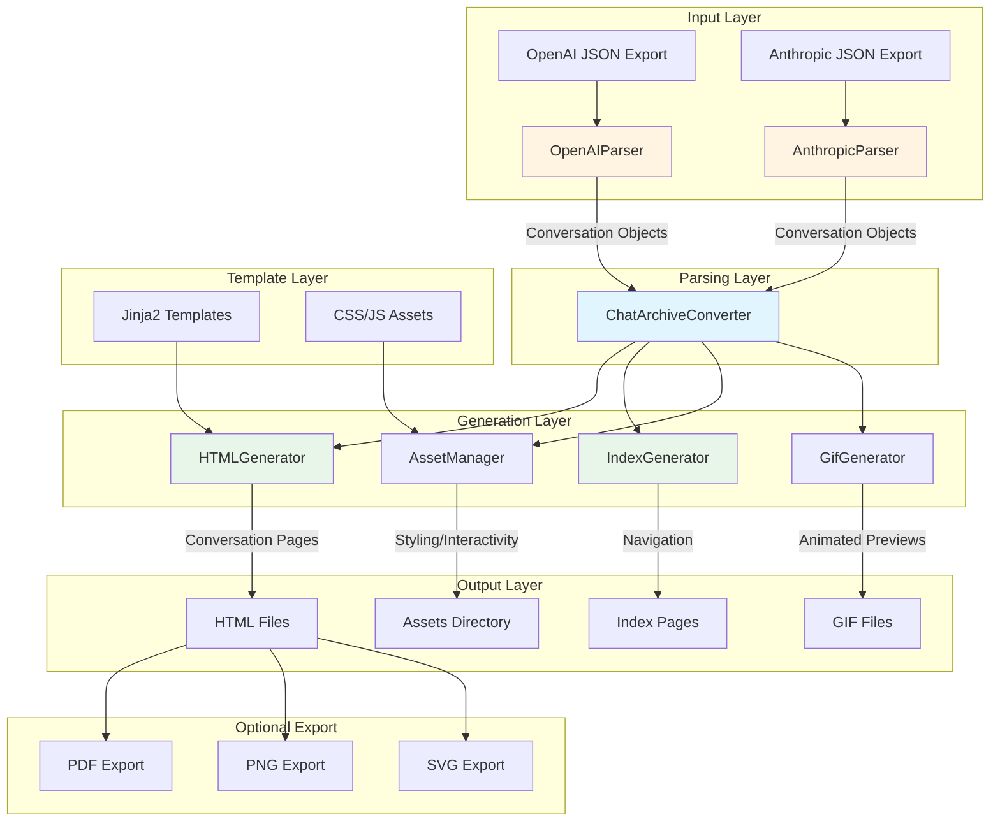
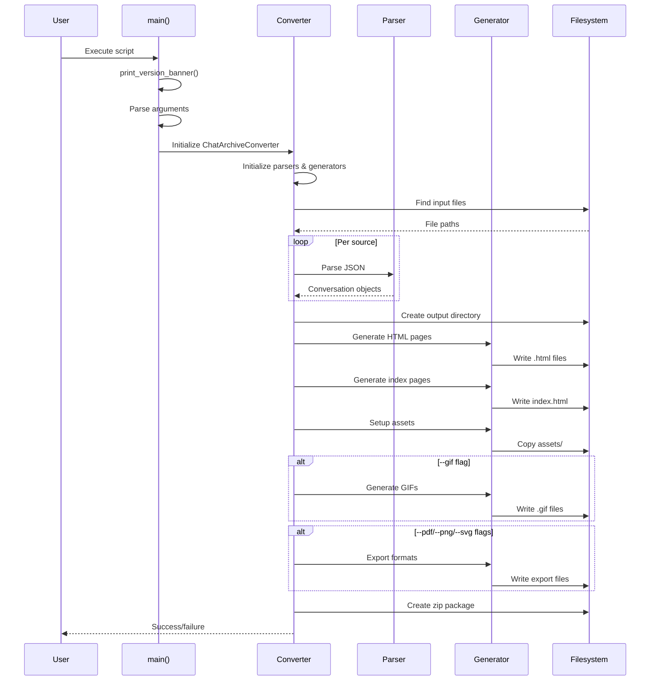
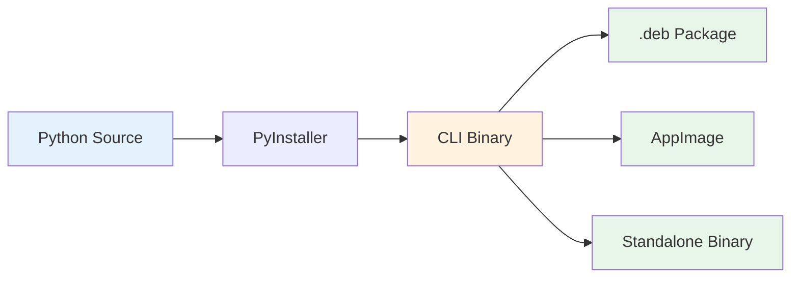

# AI Chat Reader - Architecture Documentation

**Version:** 1.0.0
**Copyright:** Copyright (C) 2025 Robin L. M. Cheung, MBA. All rights reserved.

---

## Table of Contents

1. [System Overview](#system-overview)
2. [Architecture Diagram](#architecture-diagram)
3. [Component Hierarchy](#component-hierarchy)
4. [Data Flow](#data-flow)
5. [Design Patterns](#design-patterns)
6. [Technology Stack](#technology-stack)
7. [Extension Points](#extension-points)
8. [Deployment Architecture](#deployment-architecture)

---

## System Overview

AI Chat Reader is a Python-based application that converts AI chat conversation exports (from OpenAI ChatGPT and Anthropic Claude) into static HTML archives with rich presentation features.

### Core Purpose

Transform proprietary JSON chat export formats into:
- Static HTML pages with iOS-style chat bubble presentation
- Searchable, navigable conversation archives
- Multiple export formats (PDF, PNG, SVG, GIF)
- Themeable visual presentation (9 themes planned)

### Design Philosophy

- **Offline-first**: No external dependencies during conversion
- **Format-agnostic**: Pluggable parser architecture
- **Template-driven**: Jinja2-based HTML generation
- **Asset-bundled**: Self-contained output packages

---

## Architecture Diagram



---

## Component Hierarchy

### Entry Point

**`convert_to_html.py`** - Main CLI entry point
- `print_version_banner()`: Displays copyright and version (Windsurf Rule compliance)
- `main()`: Argument parsing and orchestration
- `ChatArchiveConverter`: Core coordinator class

### Core Components

```
scripts/
├── convert_to_html.py          # Main entry point
├── config.py                   # Centralized configuration
├── build.py                    # Build and packaging script
│
├── parsers/                    # Input parsing layer
│   ├── base_parser.py         # Abstract base + Conversation model
│   ├── openai_parser.py       # OpenAI ChatGPT format
│   └── anthropic_parser.py    # Anthropic Claude format
│
├── generators/                 # Output generation layer
│   ├── html_generator.py      # Per-conversation HTML
│   ├── index_generator.py     # Index pages
│   ├── asset_manager.py       # CSS/JS/Icon bundling
│   └── gif_generator.py       # Animated GIF previews
│
├── templates/                  # Jinja2 templates
│   ├── conversation.html      # Single conversation view
│   ├── main_index.html        # Global index
│   └── source_index.html      # Per-source index
│
└── assets/                     # Static resources
    ├── script.js              # Client-side interactivity
    ├── styles.css             # Base styling
    └── icons/                 # SVG icons
```

### Component Responsibilities

| Component | Responsibility | Dependencies |
|-----------|---------------|--------------|
| **ChatArchiveConverter** | Orchestrates parsing, generation, asset management | All parsers, all generators |
| **BaseParser** | Abstract base, Conversation data model | None |
| **OpenAIParser** | Parses OpenAI export JSON format | BaseParser |
| **AnthropicParser** | Parses Anthropic export JSON format | BaseParser |
| **HTMLGenerator** | Generates individual conversation HTML pages | Jinja2, templates |
| **IndexGenerator** | Generates navigation index pages | Jinja2, templates |
| **AssetManager** | Copies and processes CSS/JS/icons | None |
| **GifGenerator** | Creates animated conversation previews | PIL, image processing |

---

## Data Flow

### Conversion Pipeline



### Data Transformations

1. **JSON Export** → `Conversation` objects (Python dataclass)
2. **Conversation** → Template context (dict)
3. **Template + Context** → HTML string (Jinja2 rendering)
4. **HTML string** → File (filesystem write)

---

## Design Patterns

### Pattern Usage

| Pattern | Implementation | Purpose |
|---------|---------------|---------|
| **Strategy Pattern** | Pluggable parsers | Support multiple export formats |
| **Template Method** | BaseParser with abstract methods | Enforce parser interface |
| **Builder Pattern** | HTMLGenerator batch methods | Complex HTML construction |
| **Facade Pattern** | ChatArchiveConverter | Simplify complex subsystem |
| **Dependency Injection** | Template paths to generators | Configurable components |

### Key Design Decisions

1. **Parser Pluggability**: New chat platforms can be added by implementing `BaseParser`
2. **Template Separation**: HTML structure separate from generation logic
3. **Asset Bundling**: Self-contained output (no external CDN dependencies)
4. **Configuration by Environment**: `config.py` provides centralized, env-aware config

---

## Technology Stack

| Layer | Technology | Rationale |
|-------|-----------|-----------|
| **Language** | Python 3.8+ | Rich ecosystem, string processing |
| **CLI Framework** | argparse | Built-in, sufficient for needs |
| **Templating** | Jinja2 | Industry standard, powerful |
| **Packaging** | PyInstaller | Single-binary distribution |
| **PDF Export** | pdfkit (wkhtmltopdf) | HTML-to-PDF rendering |
| **Image Export** | imgkit, PIL | HTML-to-image, GIF creation |
| **Configuration** | dataclasses + env vars | Type-safe, 12-factor app style |

---

## Extension Points

### Adding a New Chat Platform

1. Create new parser in `parsers/` directory
2. Inherit from `BaseParser`
3. Implement required methods:
   - `parse_file(file_path: str) -> List[Conversation]`
   - Platform-specific JSON parsing logic
4. Register in `ChatArchiveConverter.__init__()`

### Adding a New Output Format

1. Create generator in `generators/` (or extend existing)
2. Implement generation logic
3. Add CLI argument in `main()`
4. Call from `convert()` method

### Adding a New Theme

The AI Chat Reader implements 9 Windsurf UI themes as CSS-based stylesheets. See **[THEME_SYSTEM.md](../docs/THEME_SYSTEM.md)** for complete theme architecture documentation.

**Available Themes:**
1. Kinetic - Colorful, dynamic, Gumroad-inspired
2. Brutalist - Raw, honest, monospace aesthetic
3. Retro - CRT terminal vibes with scanlines
4. Neumorphism - Soft shadows, extruded surfaces
5. Glassmorphism - Frosted glass with depth
6. Y2K - Early 2000s web maximalism
7. Cyberpunk - Neon-soaked dystopian future
8. Minimal - Clean Swiss design
9. System-Auto - Follows OS theme preference

**Theme Selection:**
- CLI argument: `--theme cyberpunk`
- Environment variable: `CHAT_THEME=cyberpunk`
- UI toggle in generated HTML
- Persistent storage via localStorage

**Documentation:** See `docs/THEME_SYSTEM.md` for:
- Theme implementation details
- CSS custom properties
- Theme-specific animations
- Integration steps

---

## Deployment Architecture

### Build Pipeline



### Distribution Formats

| Format | Platform | Size | Status |
|--------|----------|------|--------|
| CLI Binary | Linux | ~52MB | ✅ Working |
| .deb Package | Debian/Ubuntu | ~52MB | ✅ Working |
| AppImage | Linux Portable | TBD | ⏳ Planned |

### Installation Methods

1. **Standalone Binary**: No installation, download and run
2. **System Package**: `.deb` for Debian/Ubuntu, system-wide installation
3. **Source**: Development mode, requires Python environment

---

## Configuration Architecture

### Configuration Hierarchy (priority order)

1. **Command-line arguments** (`--gif`, `--pdf`, etc.)
2. **Environment variables** (`CHAT_DATA_DIR`, `CHAT_THEME`, etc.)
3. **Default values** (from `config.py`)

### Key Configuration Points

| Setting | Environment Variable | Default |
|---------|---------------------|---------|
| Data directory | `CHAT_DATA_DIR` | `./data` |
| Raw input directory | `CHAT_RAW_DIR` | `$CHAT_DATA_DIR/raw` |
| HTML output directory | `CHAT_OUTPUT_DIR` | `$CHAT_DATA_DIR/html` |
| Theme selection | `CHAT_THEME` | `kinetic` (planned) |
| Log level | `CHAT_LOG_LEVEL` | `INFO` |

---

## Version and Build System

### Version Format

Following Windsurf-global-rules.md specification:

```
v<major>.<minor>[.<patch>][-<prerelease>] Build <epoch%100 * 1000 + minutes>

Example: v1.0.0 Build 43072
```

### Build Number Generation

```python
epoch = int(time.time())
epoch_mod = epoch % 100  # 2-digit day counter (resets every 100 days)
minutes = (epoch // 60) % 60  # Minutes past hour
build_num = epoch_mod * 1000 + minutes  # Always unique within day
```

### Copyright Display (Windsurf Rule)

**Critical Requirement**: Copyright MUST be displayed as FIRST step in all console/terminal apps, before any initialization that could fail.

Implementation:
```python
def print_version_banner():
    """Called FIRST in main() - before any other operations."""
    print(f"AI Chat Reader v{version} Build {build_num}")
    print("Copyright (C) 2025 Robin L. M. Cheung, MBA. All rights reserved.")
```

---

## Security Considerations

1. **Input Sanitization**: All chat content is HTML-escaped before template rendering
2. **Path Traversal Protection**: `Path` objects used for all filesystem operations
3. **Dependency Isolation**: Virtual environment recommended for development
4. **No Network Calls**: Fully offline operation by design

---

## Performance Characteristics

| Metric | Target | Notes |
|--------|--------|-------|
| File parsing | <1s per 10MB JSON | Linear with file size |
| HTML generation | <0.5s per conversation | Template rendering |
| GIF generation | ~2-5s per conversation | Image processing |
| Memory usage | <500MB for typical export | Depends on conversation count |

---

## Future Architecture Plans

### Phase 1: Theme System (Designed - Implementation Pending)

**Status**: Architecture complete, awaiting implementation (see CHECKLIST.md Phase 6)

**Documentation**: `docs/THEME_SYSTEM.md` - Complete design specification

**Planned Features:**
- [x] Theme architecture designed
- [ ] Implement 9 Windsurf theme CSS files
- [ ] Theme manager JavaScript
- [ ] CLI argument `--theme` support
- [ ] Environment variable `CHAT_THEME` support
- [ ] UI theme selector component
- [ ] Persistent theme selection (localStorage)
- [ ] Theme preview/live switching

**Themes to Implement:**
1. Kinetic - Gumroad-inspired, colorful, dynamic
2. Brutalist - Raw, monospace, high contrast
3. Retro - CRT terminal with scanlines and glow
4. Neumorphism - Soft shadows, extruded surfaces
5. Glassmorphism - Frosted glass with blur effects
6. Y2K - Early 2000s maximalism with bevels
7. Cyberpunk - Neon with glitch effects
8. Minimal - Clean Swiss design with whitespace
9. System-Auto - OS preference detection (light/dark)

### Phase 2: Cross-Platform (Considered)

- Tauri 2 for desktop wrapper
- Native macOS/Windows support
- System integration (file associations, etc.)

### Phase 3: Advanced Features (Exploratory)

- Full-text search indexing
- Conversation comparison/merge
- Export to other formats (markdown, JSON)
- Web-based viewer mode

---

**Document Version:** 1.0.0
**Last Updated:** 2025-01-14
**Maintained By:** Robin L. M. Cheung, MBA
