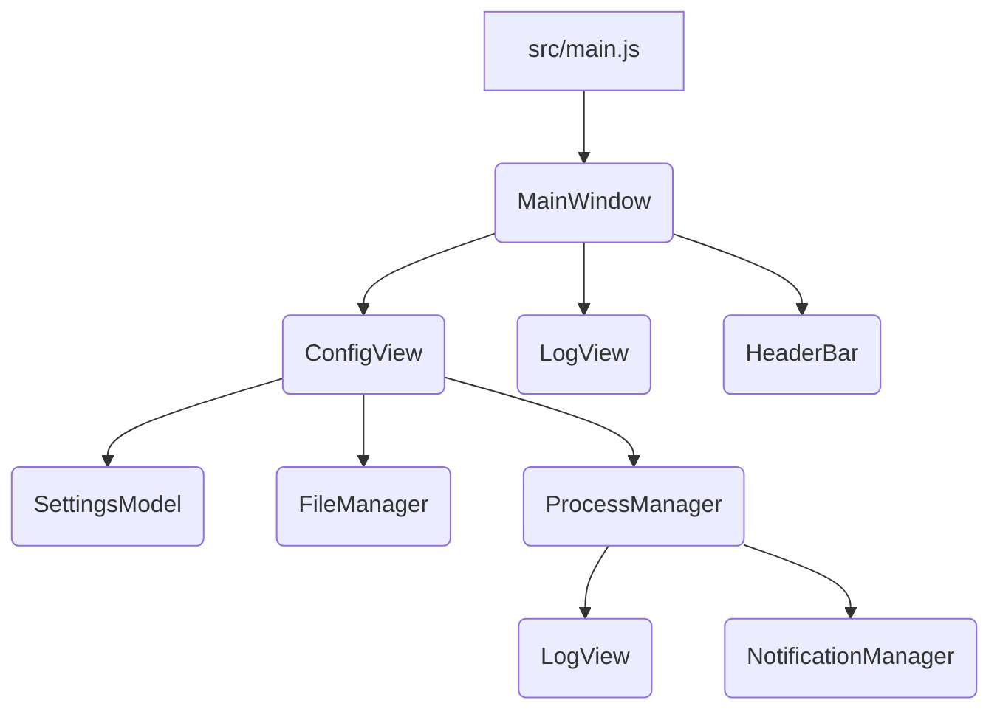

# Architecture Snapshot - 2025-07-04 (Before GUI Fix)

```mermaid
graph TD
    A[src/main.js] --> B(MainWindow)
    B --> C(ConfigView)
    B --> D(LogView)
    B --> E(HeaderBar)
    C --> F(SettingsModel)
    C --> G(FileManager)
    C --> H(ProcessManager)
    H --> I(LogView)
    H --> J(NotificationManager)
```
