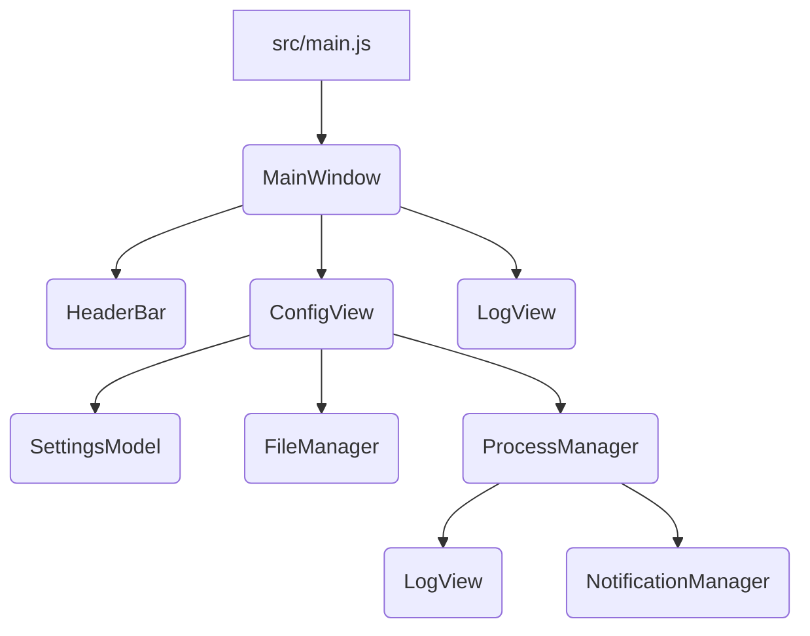

# Architecture Snapshot - 2025-07-05 (After ConfigView Fix)

```mermaid
graph TD
    A[src/main.js] --> B(MainWindow)
    B --> C(HeaderBar)
    B --> D(ConfigView)
    B --> E(LogView)
    D --> F(SettingsModel)
    D --> G(FileManager)
    D --> H(ProcessManager)
    H --> I(LogView)
    H --> J(NotificationManager)
```
