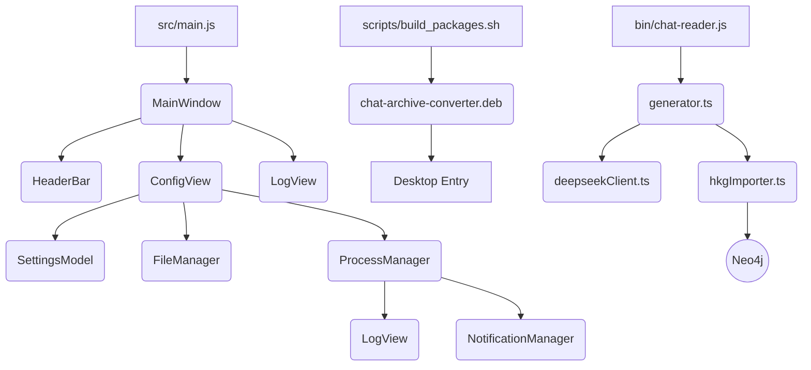

# Architecture Snapshot - 2025-07-07 (After Import to hKG)

```mermaid
graph TD
    A[src/main.js] --> B(MainWindow)
    B --> C(HeaderBar)
    B --> D(ConfigView)
    B --> E(LogView)
    D --> F(SettingsModel)
    D --> G(FileManager)
    D --> H(ProcessManager)
    H --> I(LogView)
    H --> J(NotificationManager)
    K[scripts/build_packages.sh] --> L(chat-archive-converter.deb)
    L --> M[Desktop Entry]
    N[bin/chat-reader.js] --> O(generator.ts)
    O --> P(deepseekClient.ts)
    O --> Q(hkgImporter.ts)
    Q --> R((Neo4j))
```
