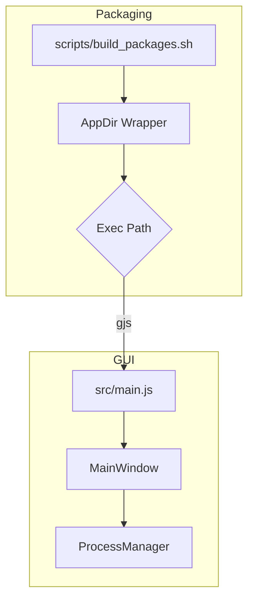
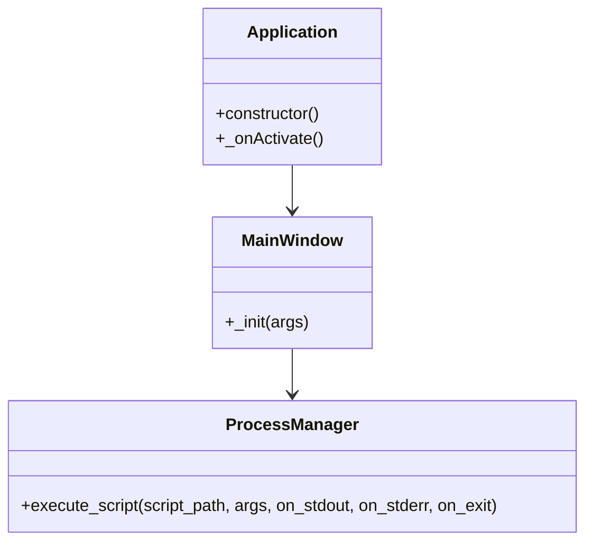

# Architecture Plan - 2025-09-26 (GNOME Launcher Regression) - Initial

**Project UUIDv8:** 8f0f72f4-7b61-8e4d-bcb3-8f7a821dc9e5

## Context Snapshot
- `src/main.js` bootstraps the GJS/Libadwaita application, extending `Adw.Application` and presenting `MainWindow`.
- `src/widgets/MainWindow.js` assembles the primary window, composing `HeaderBar`, `ConfigView`, and `LogView`, and delegating process execution to `ProcessManager`.
- `src/utils/ProcessManager.js` wraps `Gio.Subprocess` to run the Python converter with async stdout/stderr logging.
- `scripts/build_packages.sh` orchestrates PyInstaller CLI packaging, AppImage/AppDir layout, GNOME wrapper creation, desktop entry generation, and DEB assembly.

## Abstract AST Focus (Key Modules)
```text
scripts/build_packages.sh
  ├─ pyinstaller invocation → dist/chat-archive-converter-cli
  ├─ APPDIR staging
  │   ├─ install CLI binary → usr/bin/chat-archive-converter-cli
  │   ├─ wrapper script cat <<'EOF' (gjs "$DIR/main.js")
  │   ├─ copy GUI sources → usr/share/chat-archive-converter/src
  │   ├─ craft desktop entry Exec=chat-archive-converter
  │   └─ generate placeholder icon
  ├─ AppImage build via appimagetool
  └─ DEB staging mirrors AppDir layout (wrapper + CLI + src/)

src/main.js
  ├─ shebang /usr/bin/gjs
  ├─ push current_dir + '/src' into imports.searchPath
  ├─ define Application extends Adw.Application
  │   └─ _onActivate → instantiate MainWindow
  └─ Adw.init(); application.run(ARGV)

src/widgets/MainWindow.js
  ├─ registerClass MainWindow extends Adw.ApplicationWindow
  │   ├─ configure window title/size
  │   ├─ compose HeaderBar / ConfigView / LogView
  │   └─ connect 'execute-conversion' → ProcessManager.execute_script()
  └─ callback logs output and posts notifications
```

## Identified Regression
- Wrapper script written by `scripts/build_packages.sh` executes `gjs "$DIR/main.js"`, but packaging copies GUI files under `$DIR/src/`, leaving `$DIR/main.js` absent → GNOME launcher fails silently because the entry script cannot be found.

## Proposed Remediation
1. Update wrapper generation in `scripts/build_packages.sh` to execute `gjs "$DIR/src/main.js"` to match packaged layout.
2. Ensure `imports.searchPath` in `src/main.js` continues to resolve nested modules when executed from AppDir/DEB (`cd "$DIR"` already set by wrapper).
3. Run smoke test for packaging script (syntax validation / shellcheck) if feasible; otherwise, document manual testing requirement.
4. Capture post-fix architecture snapshot (final) and update checklist/test notes.

## Diagrams




## HKG Sync
- Recorded planned remediation for UUIDv8 `8f0f72f4-7b61-8e4d-bcb3-8f7a821dc9e5` in hybrid knowledge graph (see checklist for task linkage).
