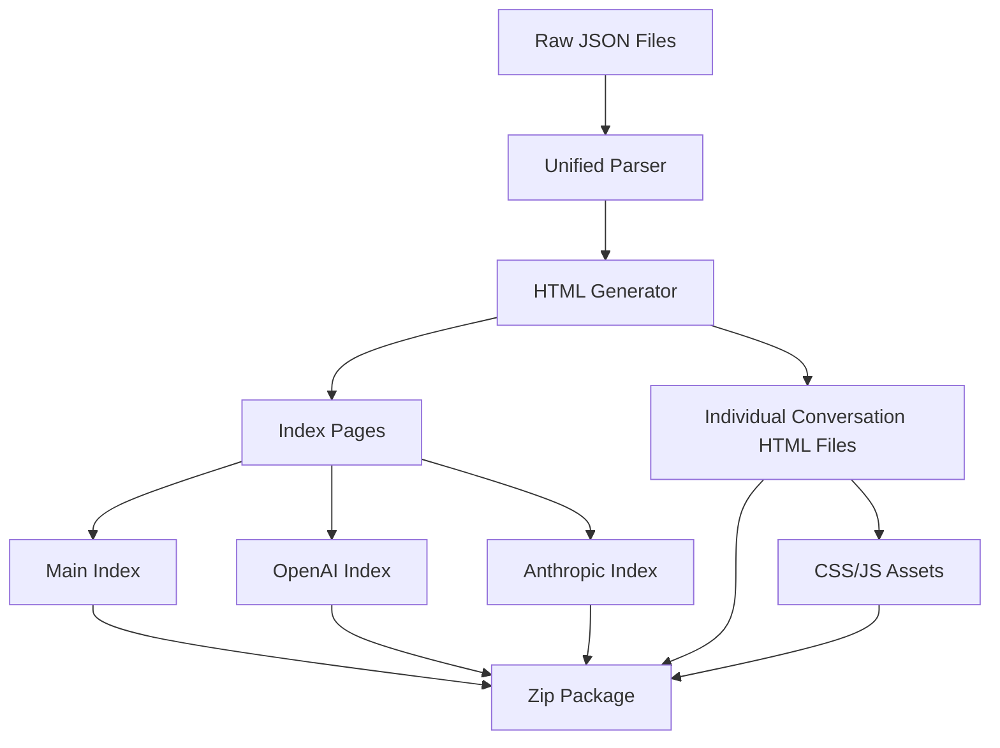
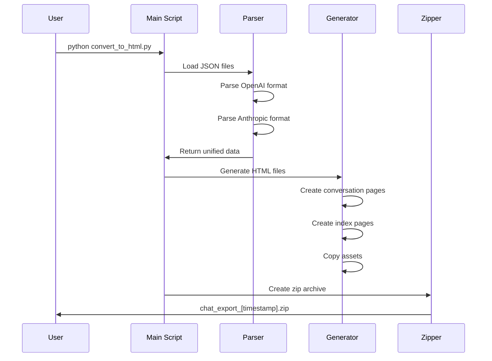

# HTML Chat Archive Converter - Implementation Plan

**UUID:** 7f3e4d92-8a1b-4c5f-b2e6-9d8c7a6b5e43
**Created:** 2025-02-06
**Status:** Approved

## Overview

This document outlines the plan for creating an HTML conversion system that transforms Anthropic and OpenAI chat archives into beautifully formatted HTML files with iOS-style chat bubbles, featuring light/dark mode support and excellent navigation UX.

## Project Goals

1. Convert JSON chat exports to individual HTML conversation files
2. Create iOS-style chat bubble interface (similar to iMessage)
3. Implement light/dark mode toggle with persistent preferences
4. Generate navigation indexes with search and filtering capabilities
5. Package everything in a ready-to-deploy zip file

## Architecture

### System Architecture



### Directory Structure

```
data/html/
├── chat_export_YYYYMMDD_HHMMSS/
│   ├── index.html                    # Main navigation page
│   ├── assets/
│   │   ├── style.css                 # iOS-style chat bubbles, light/dark mode
│   │   ├── script.js                 # Search, filtering, theme toggle
│   │   └── icons/                    # UI icons
│   ├── openai/
│   │   ├── index.html                # OpenAI-specific index
│   │   └── conversations/
│   │       ├── conv_1_YYYYMMDD.html
│   │       ├── conv_2_YYYYMMDD.html
│   │       └── ...
│   └── anthropic/
│       ├── index.html                # Anthropic-specific index
│       └── conversations/
│           ├── conv_1_YYYYMMDD.html
│           ├── conv_2_YYYYMMDD.html
│           └── ...
└── chat_export_YYYYMMDD_HHMMSS.zip  # Ready-to-deploy package
```

## Feature Specifications

### 1. iOS-Style Chat Interface
- **Chat Bubbles**: 
  - User messages: Right-aligned, blue background (#007AFF)
  - Assistant messages: Left-aligned, gray background (#E5E5EA)
  - System messages: Center-aligned, subtle styling
- **Typography**: San Francisco or system font stack
- **Spacing**: Proper padding and margins matching iOS design
- **Animations**: Smooth transitions for theme changes

### 2. Theme System
- **Light Mode** (Default):
  - Background: #FFFFFF
  - Text: #000000
  - Secondary: #8E8E93
- **Dark Mode**:
  - Background: #000000
  - Text: #FFFFFF
  - Secondary: #8E8E93
- **Toggle**: Positioned in top-right corner
- **Persistence**: Uses localStorage to remember preference

### 3. Navigation Features

#### Main Index Page (`index.html`)
- Header with title and theme toggle
- Statistics overview (total conversations, messages, date range)
- Combined chronological list of all conversations
- Search bar with real-time filtering
- Filter options:
  - Source (OpenAI/Anthropic/Both)
  - Date range picker
  - Sort by (Date, Title, Message Count)

#### Source-Specific Index Pages
- Same features as main index but filtered by source
- Breadcrumb navigation back to main index

#### Individual Conversation Pages
- Conversation header with:
  - Title
  - Date and time
  - Message count
  - Source indicator
- Chat message display with timestamps
- Navigation:
  - Previous/Next conversation links
  - Back to index breadcrumb
- Features:
  - Copy message button on hover
  - Expand/collapse long messages
  - Code block syntax highlighting

### 4. Search and Filter Implementation
- Client-side JavaScript search (no backend required)
- Searches through:
  - Conversation titles
  - Message content
  - Dates
- Real-time results update as user types
- Highlighting of matched terms

## Technical Implementation

### Data Models

```python
from dataclasses import dataclass
from datetime import datetime
from typing import List, Optional

@dataclass
class Message:
    role: str  # 'user', 'assistant', 'system'
    content: str
    timestamp: Optional[datetime]
    
@dataclass
class Conversation:
    id: str
    title: str
    source: str  # 'openai' or 'anthropic'
    created_at: datetime
    updated_at: Optional[datetime]
    messages: List[Message]
```

### Script Structure

```
scripts/
├── convert_to_html.py           # Main conversion script
├── parsers/
│   ├── __init__.py
│   ├── base_parser.py          # Abstract parser class
│   ├── openai_parser.py        # OpenAI-specific parsing
│   └── anthropic_parser.py     # Anthropic-specific parsing
├── generators/
│   ├── __init__.py
│   ├── html_generator.py       # HTML generation logic
│   ├── index_generator.py      # Index page generation
│   └── asset_manager.py        # CSS/JS asset handling
├── templates/
│   ├── conversation.html       # Individual conversation template
│   ├── index.html             # Index page template
│   └── components/
│       ├── message.html        # Message bubble component
│       └── search.html         # Search bar component
└── assets/
    ├── style.css              # Main stylesheet
    ├── script.js              # Main JavaScript
    └── icons/
        ├── moon.svg           # Dark mode icon
        └── sun.svg            # Light mode icon
```

### Processing Flow



## CSS Styling Approach

```css
/* Example of iOS-style chat bubble */
.message {
    display: flex;
    margin: 8px 16px;
    align-items: flex-end;
}

.message.user {
    flex-direction: row-reverse;
}

.bubble {
    max-width: 70%;
    padding: 8px 12px;
    border-radius: 18px;
    word-wrap: break-word;
}

.bubble.user {
    background-color: var(--user-bubble-bg);
    color: var(--user-bubble-text);
    border-bottom-right-radius: 4px;
}

.bubble.assistant {
    background-color: var(--assistant-bubble-bg);
    color: var(--assistant-bubble-text);
    border-bottom-left-radius: 4px;
}
```

## JavaScript Features

```javascript
// Example of core functionality
class ChatViewer {
    constructor() {
        this.theme = localStorage.getItem('theme') || 'light';
        this.conversations = [];
        this.initializeTheme();
        this.initializeSearch();
    }
    
    toggleTheme() {
        this.theme = this.theme === 'light' ? 'dark' : 'light';
        document.documentElement.setAttribute('data-theme', this.theme);
        localStorage.setItem('theme', this.theme);
    }
    
    searchConversations(query) {
        // Implementation for real-time search
    }
}
```

## Usage Instructions

1. Place JSON exports in `data/raw/`:
   - `openai_conversations.json`
   - `claude_conversations.json` (or `anthropic_conversations.json`)

2. Run the conversion script:
   ```bash
   python scripts/convert_to_html.py
   ```

3. The script will:
   - Create a timestamped folder in `data/html/`
   - Generate all HTML files
   - Copy CSS/JS assets
   - Create a zip file

4. Deploy the zip file:
   - Extract on any web server
   - No server-side processing required
   - Works with file:// protocol for local viewing

## Future Enhancements

1. **Export Options**:
   - PDF export for individual conversations
   - Markdown export option
   - CSV export for data analysis

2. **Advanced Features**:
   - Conversation tagging system
   - Bookmark favorite messages
   - Statistics dashboard
   - Share conversations via unique URLs

3. **Performance**:
   - Lazy loading for large conversation lists
   - Virtual scrolling for long conversations
   - Service worker for offline viewing

## Success Criteria

- [ ] All conversations properly converted to HTML
- [ ] iOS-style chat interface working correctly
- [ ] Light/dark mode toggle functional
- [ ] Search and filtering working smoothly
- [ ] Zip package ready for deployment
- [ ] Mobile-responsive design verified
- [ ] Cross-browser compatibility tested

## Next Steps

After approval of this plan:
1. Switch to Code mode for implementation
2. Create the script structure
3. Implement parsers for both formats
4. Build HTML generators with templates
5. Create CSS/JS assets
6. Test with sample data
7. Generate final zip package