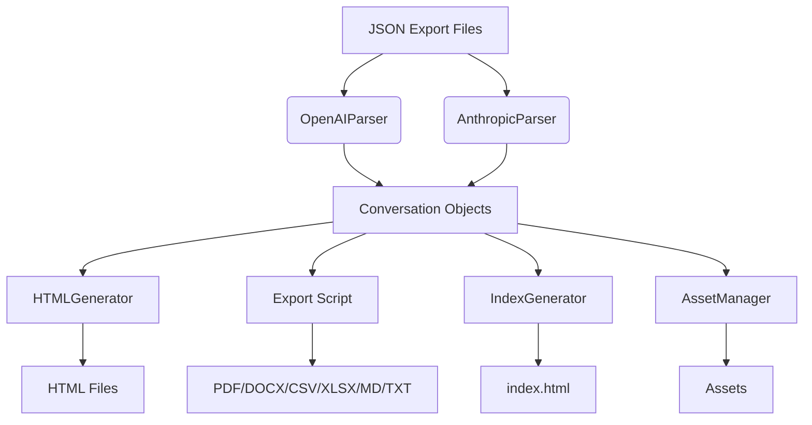

# Repository Architecture

```mermaid
graph TD
    A[JSON Export Files] --> B(OpenAIParser)
    A --> C(AnthropicParser)
    B --> D[Conversation Objects]
    C --> D
    D --> E[HTMLGenerator]
    D --> F[Export Script]
    E --> G[HTML Files]
    D --> H[IndexGenerator]
    H --> I[index.html]
    D --> J[AssetManager]
    J --> K[Assets]
    F --> L[PDF/DOCX/CSV/XLSX/MD/TXT]
```

This diagram summarizes how chat exports are transformed into multiple output formats within this project.
